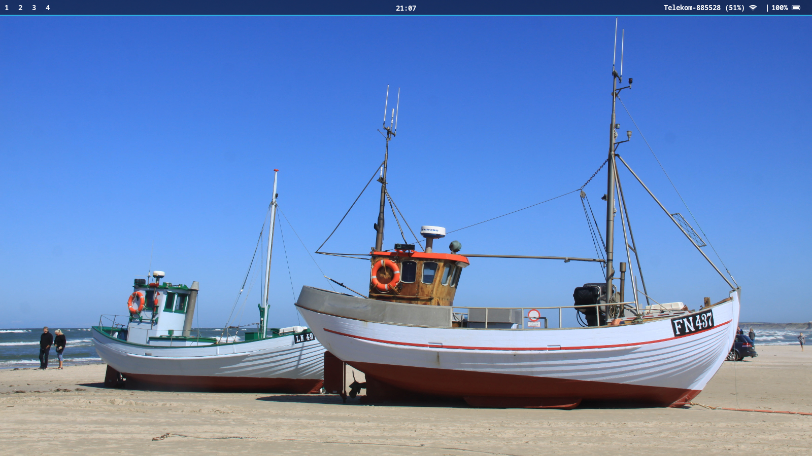
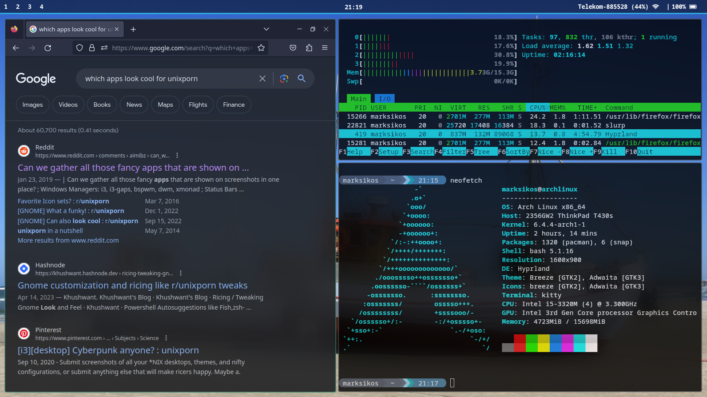

# Hyperland-Desktop 
A highly customized hyperland setup on arch linux for newbies and pros, feel free to use it :)   
<h2>Requirements</h2> 
What you need:  

1. Hyprland DE and all dependencies 
2. Kitty shell and Starship for customization 
3. Rofi, grimblast, pulseaudio etc.. for basic funcitons 
4. Sway's waybar (but others i.e. Dmenu works fine as well)  

<h2>Setup</h2> 
KDE is recommended, but should woek as well on GNOME, Sway etc.. too. Otherwise  try:  

``` 
sudo pacman -Sy wayland libdrm pixman libxkbcommon python2 
libxml2 /  llvm libpng gegl mtdev xorg-xwayland  qt5-wayland qt6-wayland
```  

You might as well need specific xorg based dependencies for your environment.   

<h2>Installation</h2>  

```
mkdir ~/github 
cd ~/github 
git clone  
``` 
After this, you can replace (some of) the contents of files in the .config folder to your configuration files located in ~/.config. If they dont exest yet, just copy all of it.  

NOTICE: Onc you change the content of .config/hyr/hyprland.conf, upon savig it compiles automatically, so you will be able to see changees immediately. With Kitty, waybar etc.. You will have to  
``` 
killall kitty
``` 
or
```
killall waybar waybar & disown 
``` 
in terminal to see updates.  

<h2>Keybinds</h2> 
You will have to set up your own spedial keybinds according to your taste, mine looks like:  

``` 
bind = $mainMod, RETURN, exec, kitty 
bind = $mainMod, V, killactive, 
bind = $mainMod, P, togglefloating, 
bind = , PRINT, exec, grimblast --notify --cursor copysave area 
bind = $mainMod,SPACE,  exec, rofi -show run 
```  

<h2>Official Website</h2> 
See all available options for personalizations: 

[Hyprland Configuration Page](https://wiki.hyprland.org/Configuring/Configuring-Hyprland) 

<h1>Gallery</h1> 

 
 
